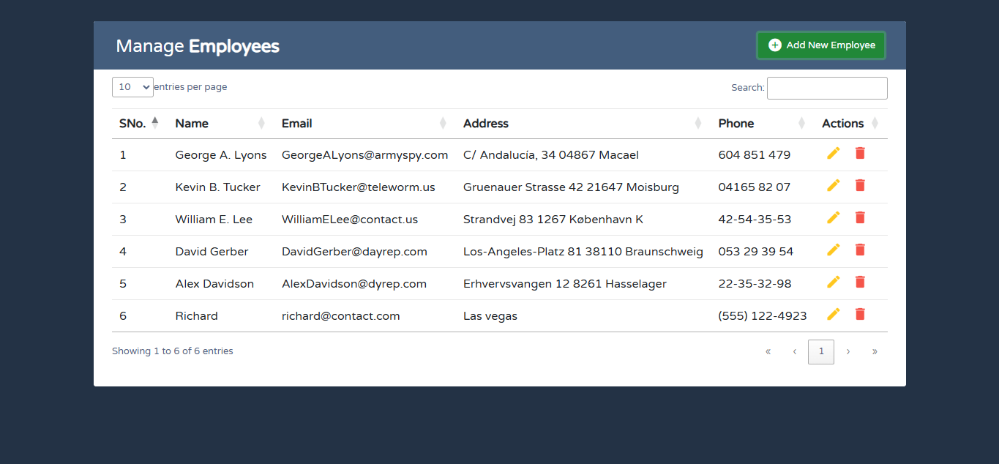
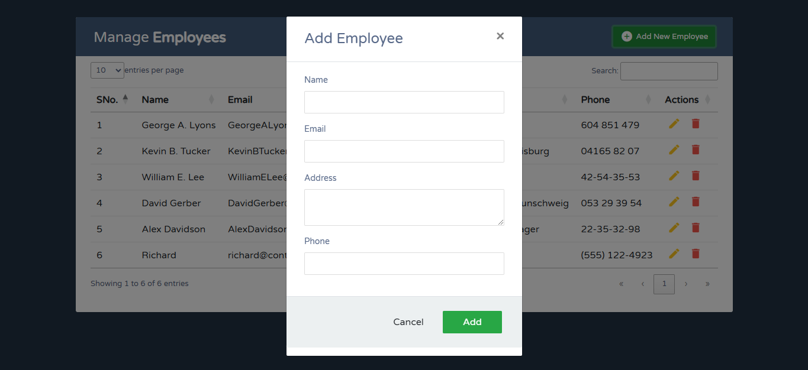
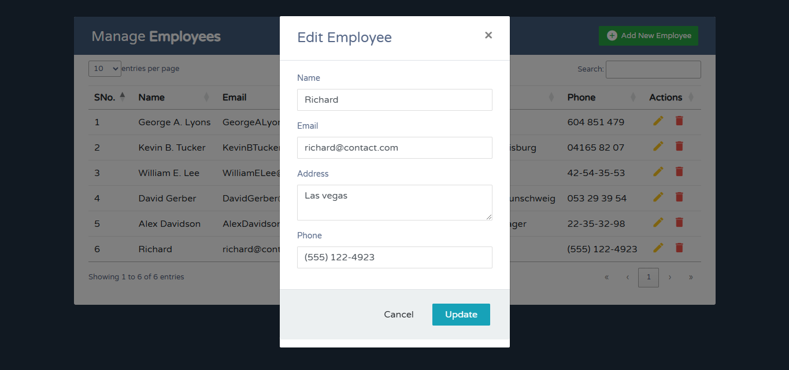
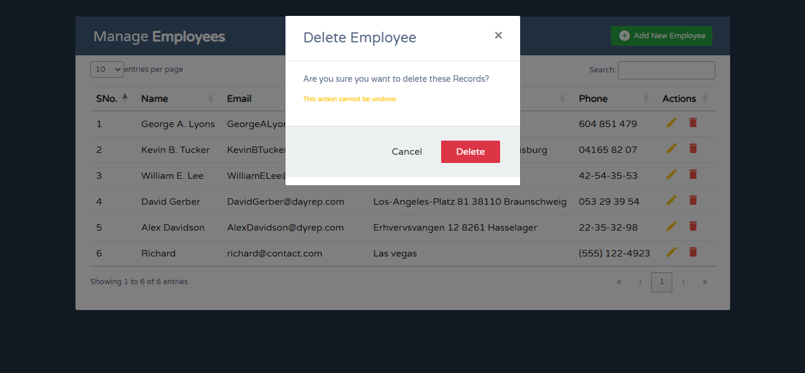
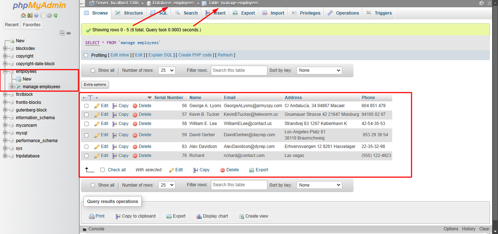

# Employee Management System

This project is a simple Employee Management System built using PHP, MySQLi, JavaScript, and DataTables. It allows you to perform CRUD (Create, Read, Update, Delete) operations on employee records, utilizing a modal form for adding and editing entries.

## Features

- **Add Employee**: Use a modal form to input new employee details.
- **View Employee List**: Displays a table of all employee records, with sortable and searchable columns powered by DataTables.
- **Edit Employee**: Allows updating employee details through a modal form.
- **Delete Employee**: Delete individual records with a confirmation modal.
- **Responsive Design**: Built with Bootstrap 4 for a responsive and clean UI.

## Technologies Used

- **Frontend**: HTML, CSS, Bootstrap 4, JavaScript, DataTables
- **Backend**: PHP (MySQLi for database interactions)
- **Database**: MySQL

## Installation

1. **Clone the Repository**
    ```bash
    git clone https://github.com/MD-ANIKS/crud-operations-php-mysqli.git
    cd crud-operations-php-mysqli
    ```

2. **Set Up Database**
   - Create a MySQL database named `employees`.
   - Import the `employees.sql` file located in the project root into your database.

3. **Configure Database Connection**
   - Open the `db_connect.php` file and set your database credentials:
     ```php
     $servername = "your_server_name";
     $username = "your_username";
     $password = "your_password";
     $database = "employee_db";
     ```

4. **Run the Application**
   - Open the project in a local server environment (e.g., Laragon, XAMPP, WAMP, or MAMP).
   - Access the project at `http://localhost/crud-operations-php-mysqli/`.

## Usage

- **Add Employee**: Click the "Add New Employee" button to open the modal form, fill out the fields, and submit.
- **Edit Employee**: Click the edit icon next to an employee's details, modify the information in the modal, and save changes.
- **Delete Employee**: Click the delete icon to open the delete confirmation modal and confirm the deletion.

## File Structure

- **index.php**: The main file containing the UI and CRUD operations.
- **db_connect.php**: Database connection file.
- **assets/**: Contains external CSS and JS libraries (Bootstrap, Font Awesome, DataTables).
- **modals/**: Contains modal HTML structures for add, edit, and delete operations.

## Screenshots

### Employee List with Actions


### Add Employee Modal


### Edit Employee Modal


### Delete Confirmation Modal


### MySQL Database Screenshot
This screenshot shows the structure of the MySQL database, including the tables used to store employee data.


## Contributing

1. Fork the repository.
2. Create a new branch: `git checkout -b feature-branch-name`.
3. Make your changes and commit them: `git commit -m 'Add some feature'`.
4. Push to the branch: `git push origin feature-branch-name`.
5. Submit a pull request.

## License

This project is licensed under the MIT License.

---

**Note**: Make sure to replace placeholders like `your_server_name`, `your_username`, `your_password`, and the repository URL as needed.
